# MBrew

MBrew is a local-first brewing companion for craft beer enthusiasts and professional brewers. It combines recipe design, key brewing calculations, end-to-end batch tracking, and visual analytics into one workflow so you can reliably hit your target profile and reproduce your best batches.

## Highlights

- Smart recipe design with BJCP style guidance and real-time OG/FG/ABV/IBU/SRM calculations
- Full process tracking across mash, boil, fermentation, and aging (time/temperature/gravity)
- Ingredient library and inventory for fermentables, hops, yeast, and misc additions (custom items supported)
- Visual analytics for fermentation trends, inventory changes, and cost breakdowns
- Privacy-first: local storage and offline usage
- Multi-language: English, Simplified Chinese, German, and French

## Docs

| Language | File |
| --- | --- |
| English (US) | doc/APP_STORE_DESCRIPTION_en-US.md |
| Simplified Chinese | doc/APP_STORE_DESCRIPTION_zh-CN.md |
| German | doc/APP_STORE_DESCRIPTION_de-DE.md |
| French | doc/APP_STORE_DESCRIPTION_fr-FR.md |

## Privacy Policy

- Privacy Policy (default): PRIVACY_POLICY.md
- Simplified Chinese: pri/PRIVACY_POLICY_zh-CN.md
- German: pri/PRIVACY_POLICY_de-DE.md
- French: pri/PRIVACY_POLICY_fr-FR.md

## Screenshots

### English (en-US)

|  |  |  |
| --- | --- | --- |
| 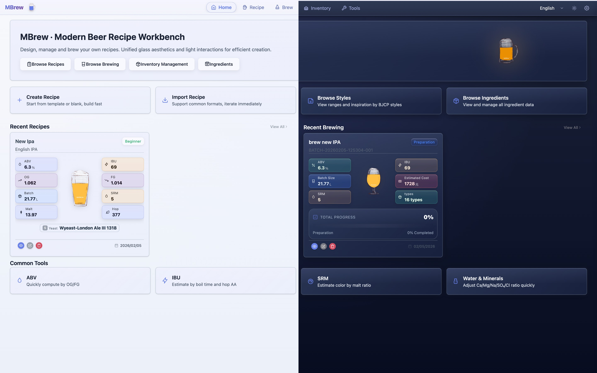 |  |  |
| 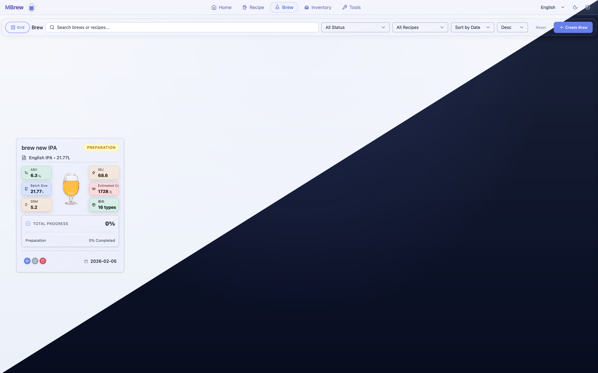 | 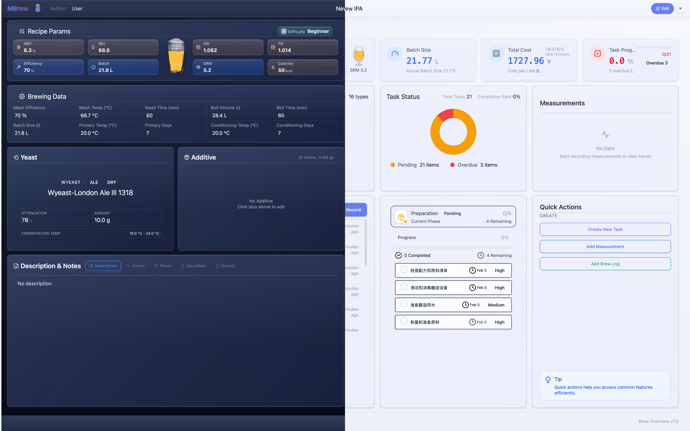 | 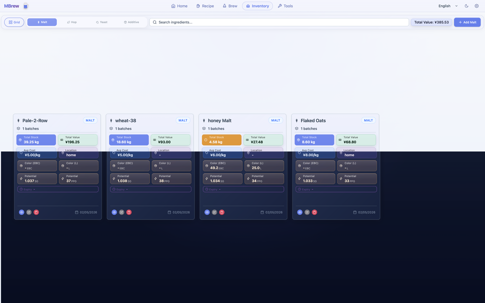 |
| 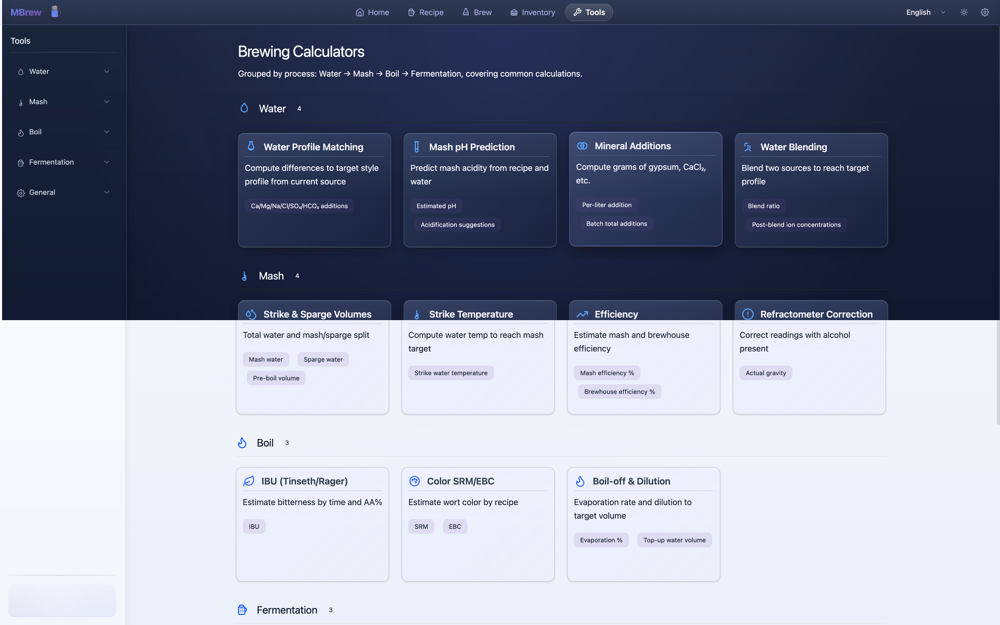 |  |  |

Other languages

### Simplified Chinese (zh-CN)

|  |  |  |
| --- | --- | --- |
|  |  |  |
|  |  |  |
|  |  |  |

### German (de-DE)

|  |  |  |
| --- | --- | --- |
|  |  |  |
|  |  |  |
|  |  |  |

### French (fr-FR)

|  |  |  |
| --- | --- | --- |
| 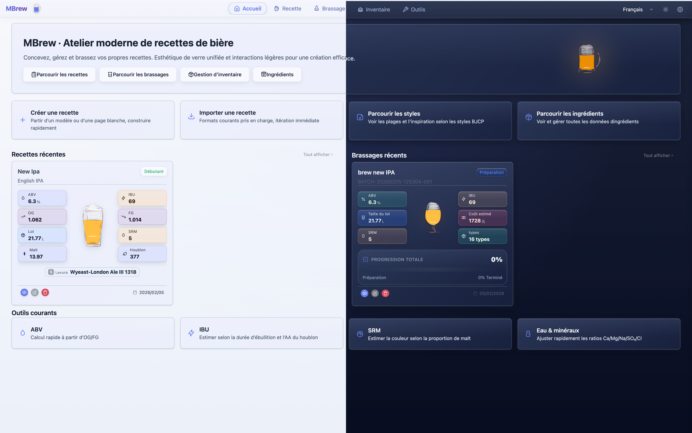 | 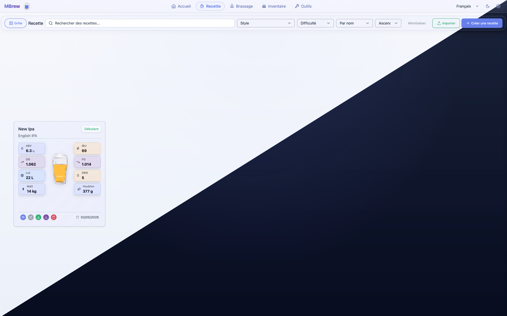 | 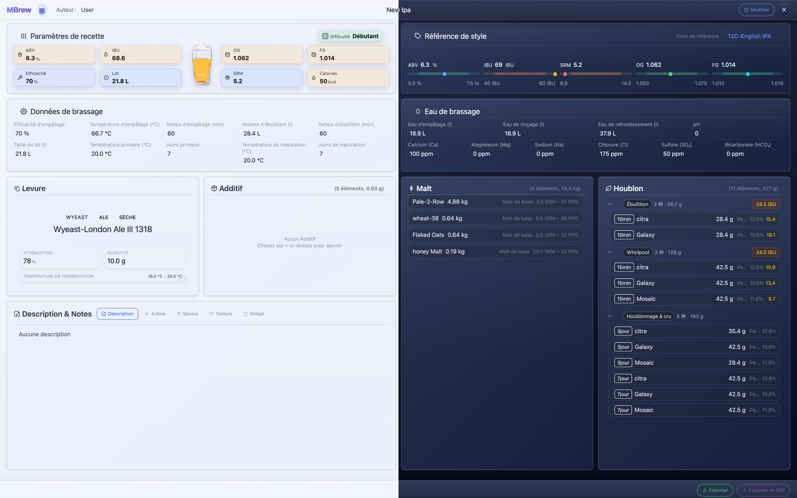 |
| 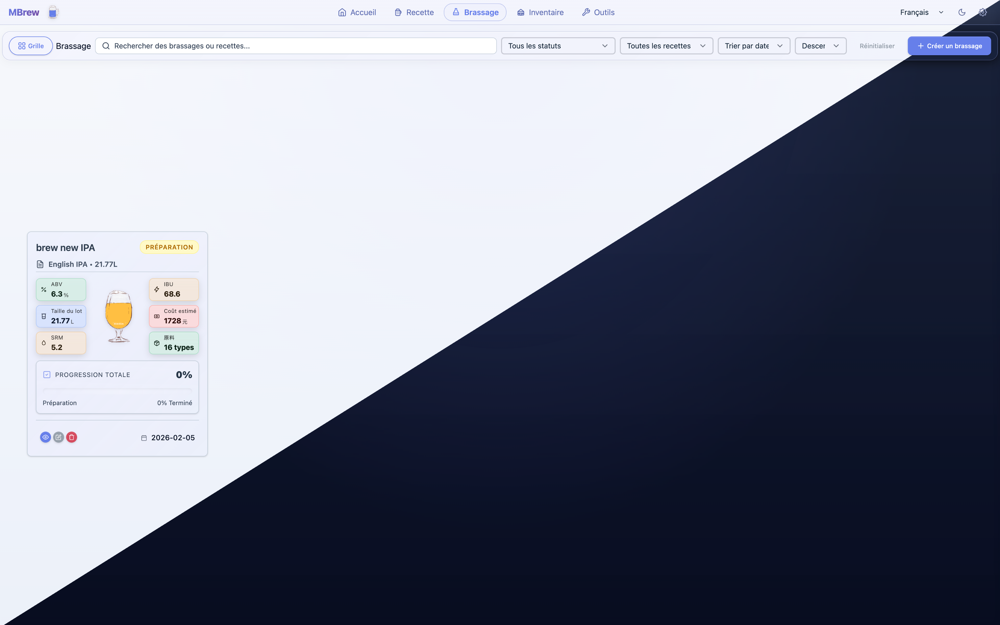 | 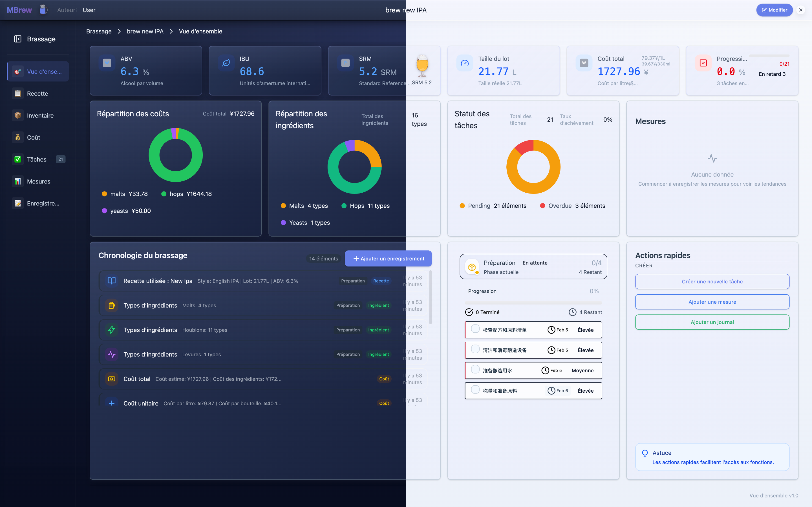 | 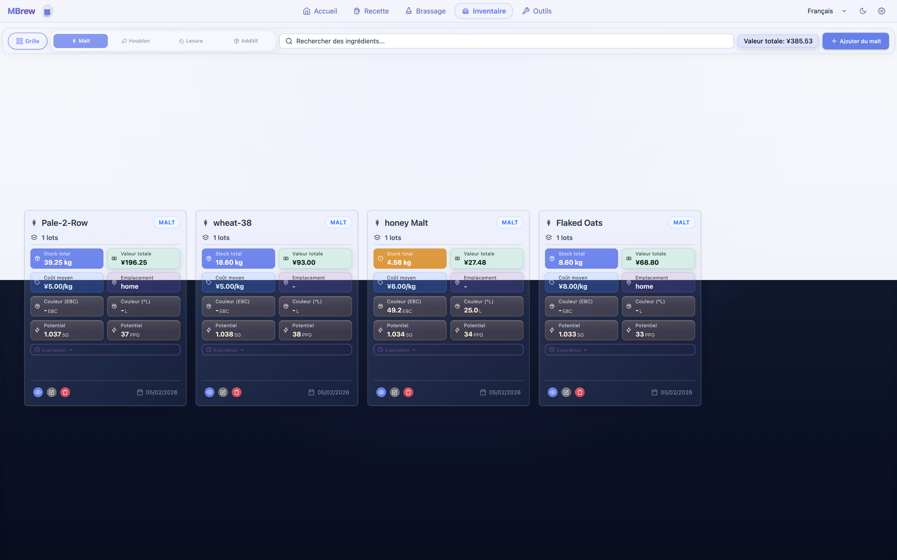 |
| 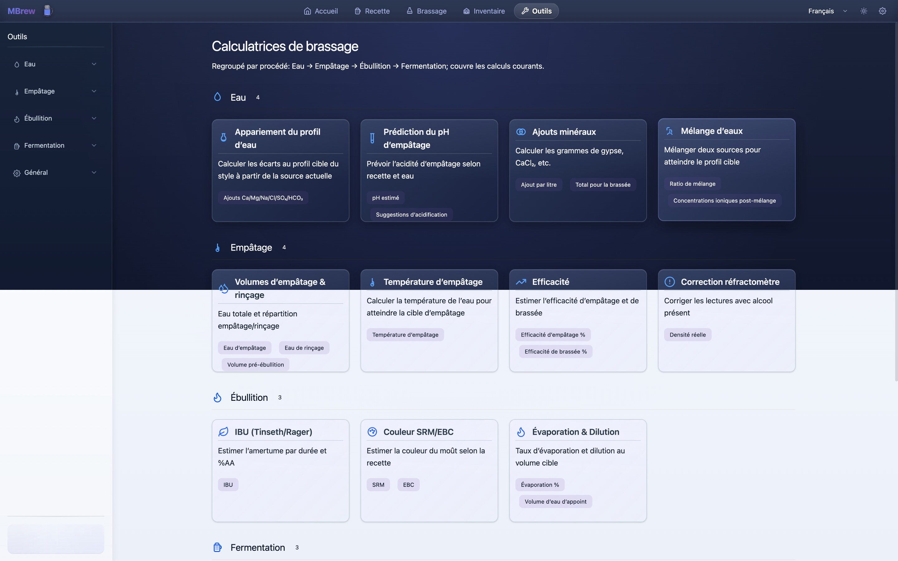 | 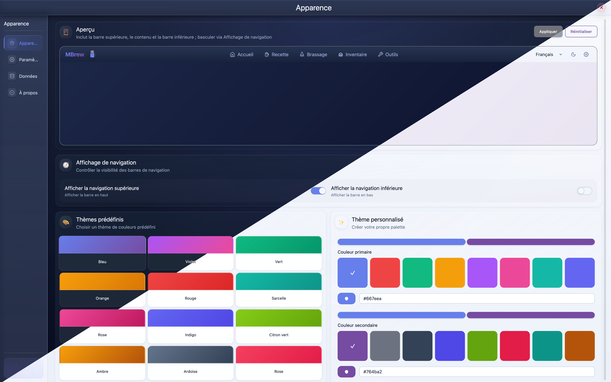 |  |

