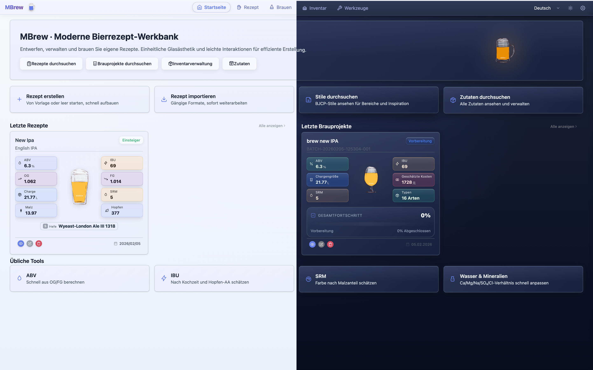
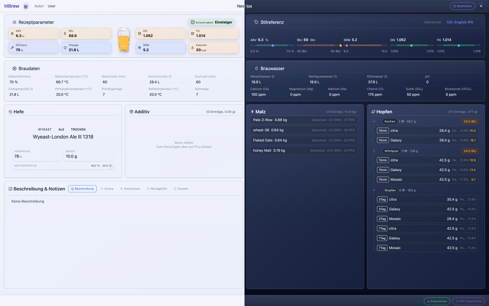
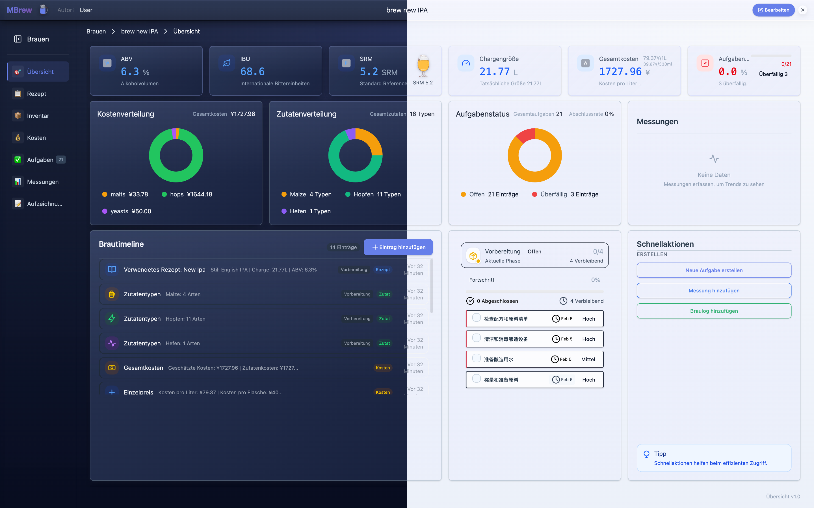
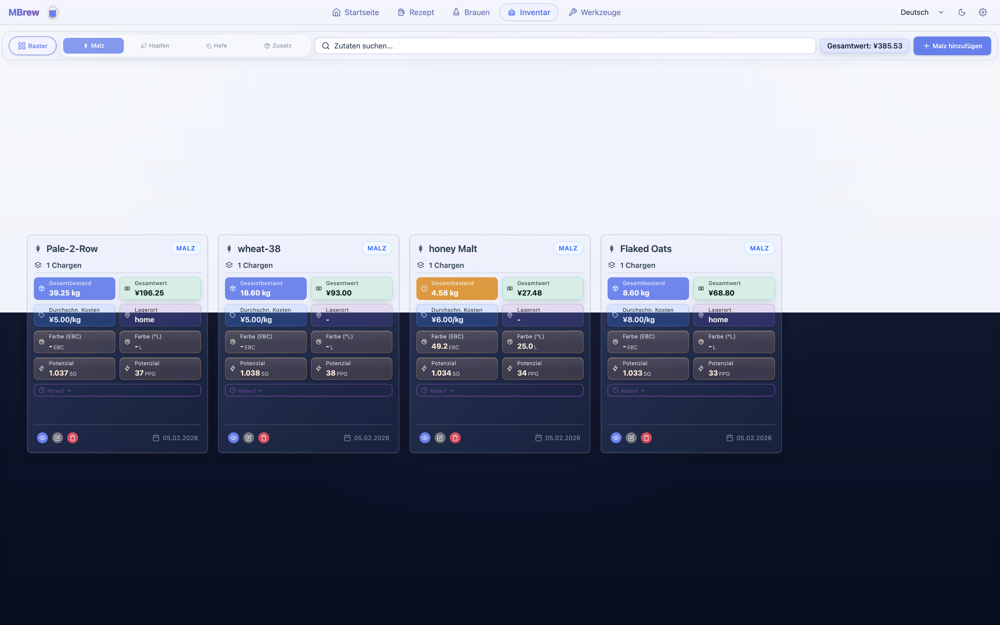
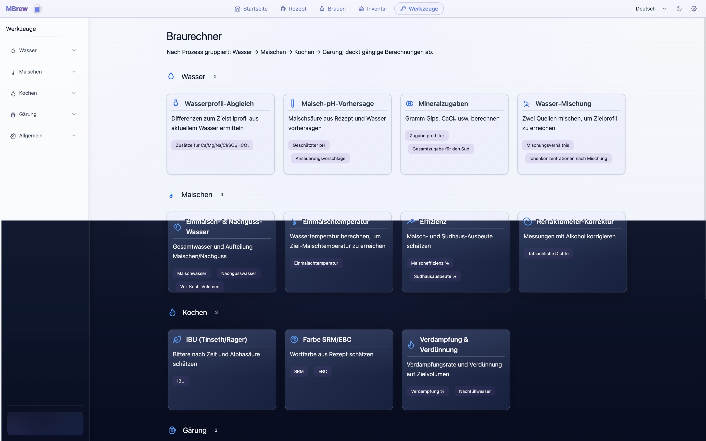
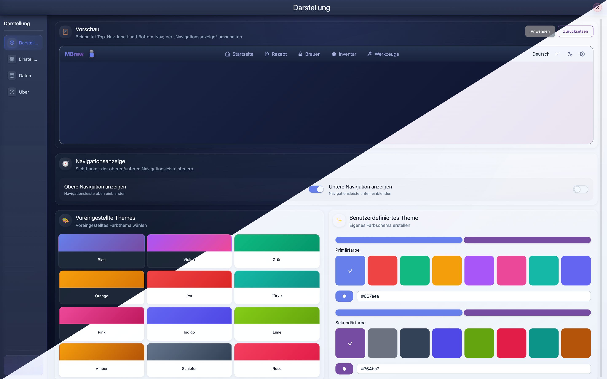

# MBrew: Brauassistent für Craft Beer (Projektvorstellung)

MBrew: Local-first Begleiter für Bier-Enthusiasten & Brauer. Rezepte entwickeln, Werte berechnen, Brauprozesse verfolgen. Zielprofile treffen & Ergebnisse wiederholen.

## Für wen ist das?

| Zielgruppe | Nutzen |
| --- | --- |
| Einsteiger im Heimbrauen | Strukturierte Aufzeichnung + Berechnungen, weniger Trial-and-Error |
| Fortgeschrittene | Schneller iterieren dank Echtzeit-Kennzahlen beim Anpassen von Rezepten |
| Profis / kleine Brauereien | Chargen nachvollziehbar dokumentieren und standardisieren |

## Kernfunktionen

| Bereich | Funktion | Mehrwert |
| --- | --- | --- |
| Rezeptdesign | BJCP-Stilrichtlinien; Echtzeit OG/FG/ABV/IBU/SRM | Änderungen sofort bewerten |
| Prozessverfolgung | Maischen/Kochen/Gärung/Reifung mit Zeit, Temperatur, Dichte | Konstanz erhöhen, Bestes wiederholen |
| Zutatenverwaltung | Malz/Hopfen/Hefe/Zusätze; eigene Zutaten möglich | Lager im Blick behalten, Wissen aufbauen |
| Datenvisualisierung | Diagramme zu Gärverlauf, Bestand, Kosten | Prozesse datenbasiert optimieren |
| Privatsphäre | Lokale Speicherung; offline nutzbar | Rezepte bleiben auf dem Gerät |
| Sprachen | Deutsch / Englisch / Chinesisch / Französisch | Bessere Zusammenarbeit international |

## App-Details

MBrew integriert den kompletten Brauprozess - von der Rezeptentwicklung bis zur Chargendokumentation - und löst alle Ihre Craft-Bier-Bedürfnisse an einem Ort. Eingebaute BJCP-Stilrichtlinien helfen Ihnen, Standardparameter für verschiedene Bierstile schnell zu beherrschen. Echtzeitberechnungen ermöglichen es Ihnen, Rezepte sofort anzupassen und Änderungen bei OG, FG, ABV, IBU, SRM und anderen wichtigen Kennzahlen zu sehen - kein Raten mehr.

Vollständige Prozessverfolgung zeichnet detaillierte Daten für jede Phase auf: Maischen, Kochen, Gärung und Reifung - mit Zeit, Temperatur, Dichte und mehr. Dies gewährleistet Chargenkonsistenz und hilft Ihnen, großartige Ergebnisse zu reproduzieren. Die Zutatenverwaltung verwaltet Bestände für Malz, Hopfen, Hefe und alle Braumaterialien, mit Unterstützung für benutzerdefinierte Zutaten zum Aufbau Ihrer eigenen Zutaten-Wissensdatenbank.

Datenvisualisierung macht komplexe Braudaten auf einen Blick klar - zeigt Gärtrends, Bestandsveränderungen und Kostenaufstellungen. Am wichtigsten: MBrews lokales Design behält alle Ihre Daten auf Ihrem Gerät, funktioniert offline und schützt Ihre Rezept-Privatsphäre.

Ob Sie ein neuer Heimbrauer sind, der gerade anfängt, ein fortgeschrittener Brauer, der präzise Kontrolle sucht, oder ein professioneller Brauer, der standardisierte Prozesse benötigt - MBrew bietet die richtige Lösung. Lassen Sie das Brauen wissenschaftlicher werden und erreichen Sie Ihr Zielprofil jedes Mal.

## Stichwörter

craft beer, brauen, rezept, rechner, heimbrauer, hopfen, malz, hefe, BJCP

## Screenshots (de-DE)

|  |  |  |
| --- | --- | --- |
|  |  |  |
|  |  |  |
|  |  |  |

## Links

- Repository: https://github.com/mimeoff/MBrew
