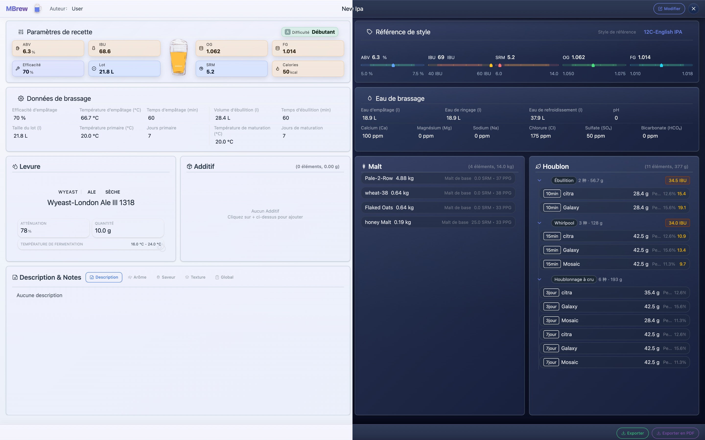

# MBrew : Assistant de brassage de bière artisanale (Présentation du projet)

MBrew est un outil local-first pour les amateurs de bière artisanale et les brasseurs professionnels. Il regroupe la conception de recettes, le calcul des indicateurs, le suivi complet du brassage et la visualisation des données, afin d’atteindre plus facilement le profil souhaité et de reproduire vos meilleurs brassins.

## Pour qui ?

| Public | Bénéfice |
| --- | --- |
| Débutants | Suivi structuré + calculs essentiels pour limiter les essais/erreurs |
| Brasseurs avancés | Itérations rapides avec des statistiques en temps réel |
| Pros / petites brasseries | Historique de lots traçable et reproductible |

## Fonctionnalités principales

| Domaine | Fonction | Valeur |
| --- | --- | --- |
| Recettes intelligentes | Guides BJCP intégrés ; calculs OG/FG/ABV/IBU/SRM en temps réel | Visualiser l’impact de chaque ajustement |
| Suivi de processus | Empâtage/ébullition/fermentation/maturation : temps, température, densité | Améliorer la constance et répéter les réussites |
| Bibliothèque d’ingrédients | Gestion malt/houblon/levure/additifs ; ingrédients personnalisés | Mieux gérer le stock et capitaliser la connaissance |
| Visualisation | Graphiques : tendances de fermentation, stock, coûts | Optimiser avec une approche data-driven |
| Confidentialité | Stockage local ; utilisable hors ligne | Vos recettes restent sur l’appareil |
| Langues | Français / Anglais / Chinois / Allemand | Collaboration plus simple à l’international |

## Mots-clés

bière artisanale, brassage, recette, calculateur, houblon, malt, levure, BJCP

## Captures d’écran (fr-FR)

|  |  |  |
| --- | --- | --- |
|  |  |  |
|  |  |  |
|  |  |  |

## Liens

- Dépôt : https://github.com/mimeoff/MBrew
