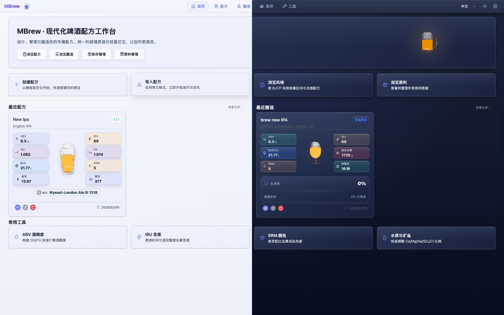
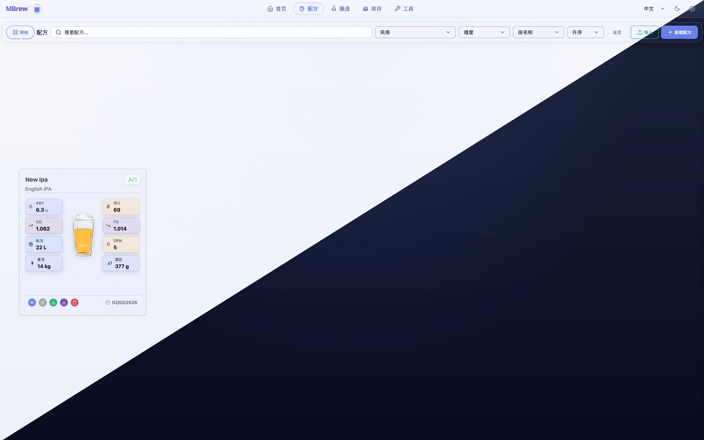
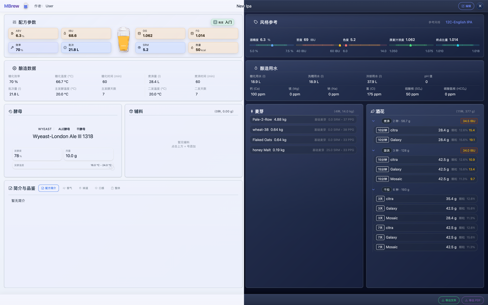
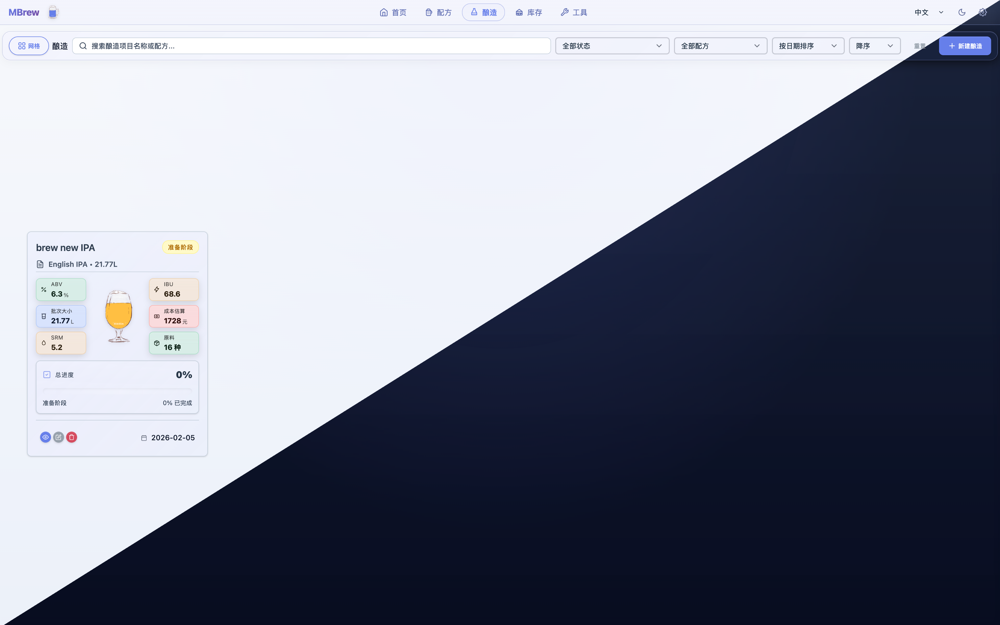
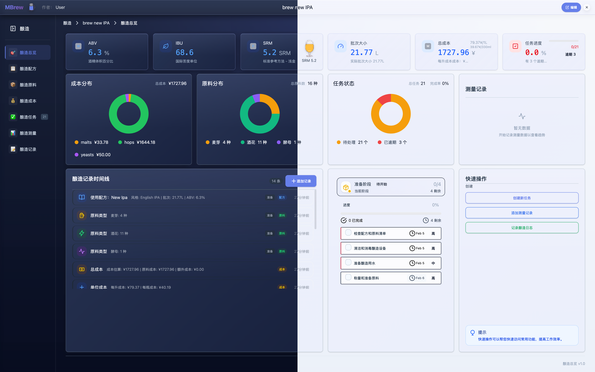
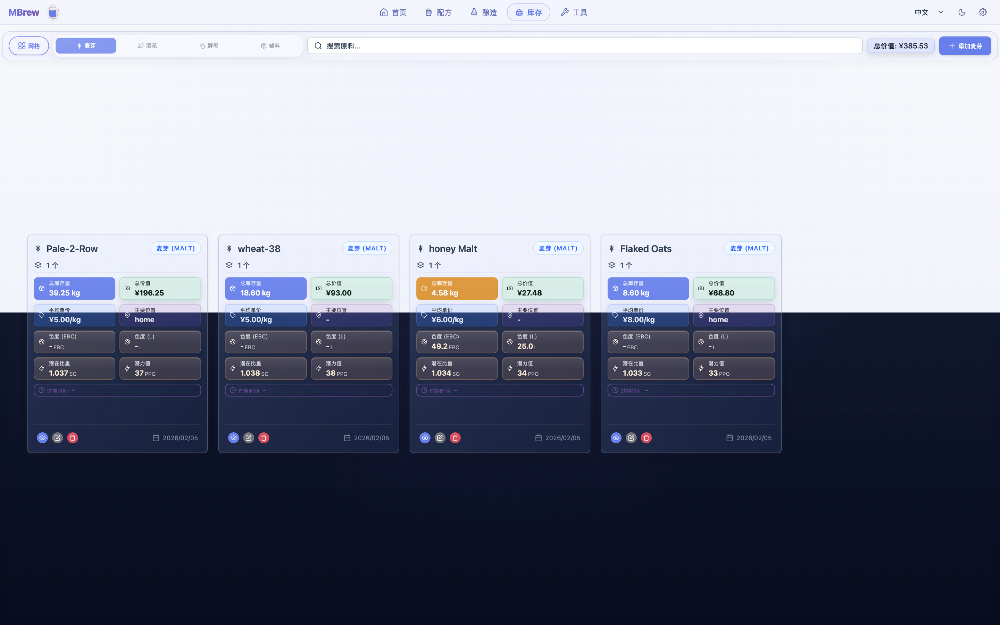
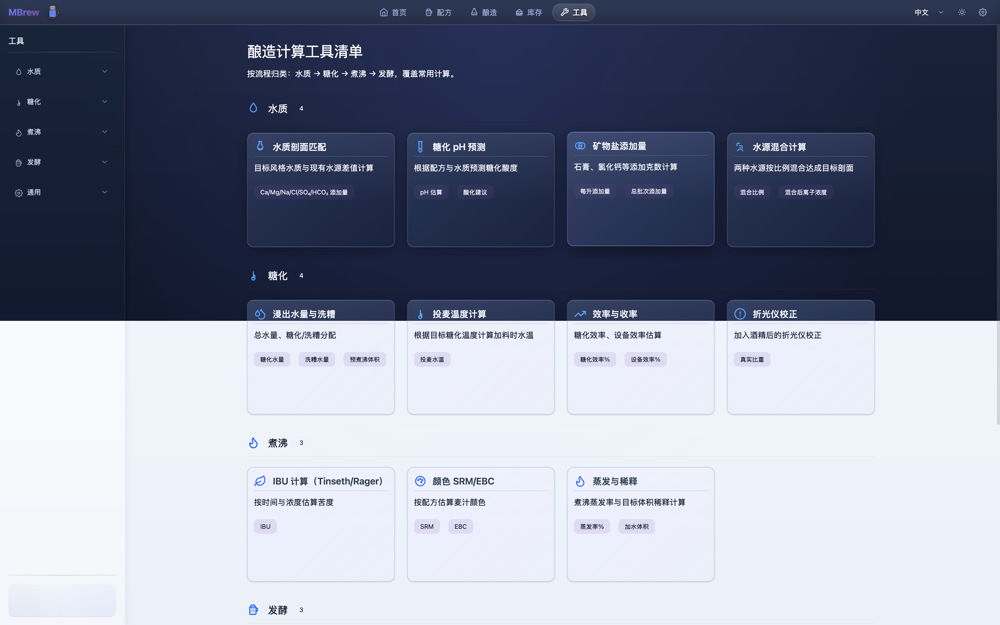
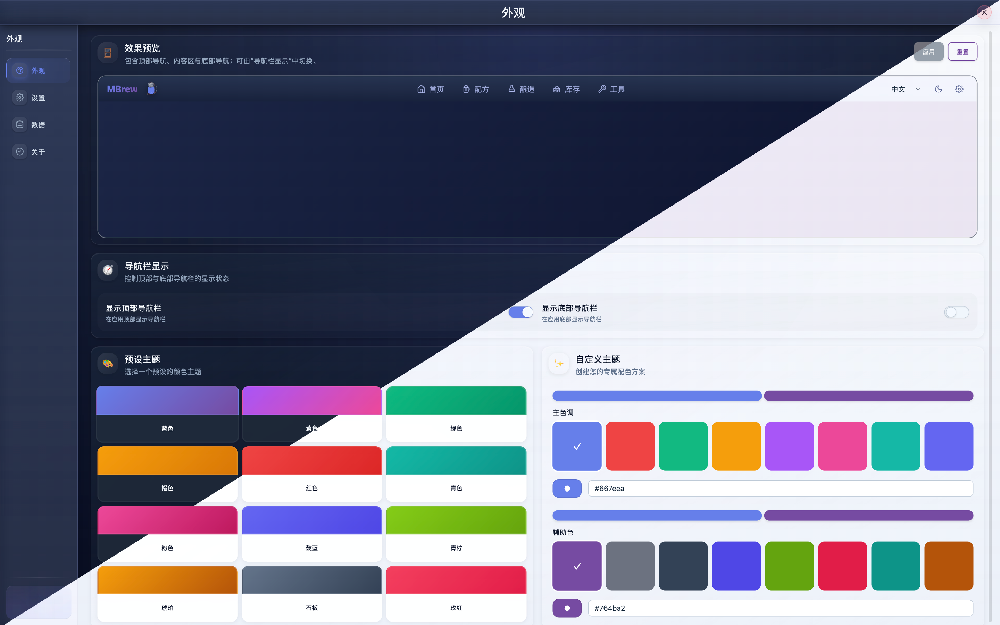

# MBrew：精酿啤酒配方设计与酿造助手（项目介绍）

MBrew 是一款面向精酿啤酒爱好者与专业酿酒师的本地优先（Local-first）酿造管理工具，覆盖配方设计、关键指标计算、全流程记录与数据分析，帮助你更稳定地“做出目标风味、复刻最佳批次”。

## 适用人群

| 人群 | 你会得到什么 |
| --- | --- |
| 家酿新手 | 按步骤记录与计算，减少试错成本 |
| 进阶玩家 | 配方迭代更快，关键参数更可控 |
| 专业酿酒师/小型酒厂 | 批次数字化留档，过程可追溯可复刻 |

## 核心能力

| 模块 | 能力 | 价值 |
| --- | --- | --- |
| 智能配方设计 | 内置 BJCP 风格指南；实时计算 OG/FG/ABV/IBU/SRM 等 | 调整配方即可看到结果，更快逼近目标风味 |
| 全流程追踪 | 糖化/煮沸/发酵/熟成记录时间、温度、比重等 | 强化批次一致性，轻松复刻最佳作品 |
| 原料库管理 | 麦芽/啤酒花/酵母/辅料库存管理；支持自定义 | 备料更安心，原料信息可沉淀 |
| 数据可视化 | 发酵趋势、库存变化、成本构成图表化呈现 | 用数据优化工艺与成本控制 |
| 隐私安全 | 本地存储、离线可用（无需联网） | 配方与记录留在设备内，更安心 |
| 多语言 | 简体中文/English/Deutsch/Français | 方便跨语言交流与团队协作 |

## 应用详情

MBrew 集成了完整的酿造工作流，从配方设计到批次记录，一站式解决精酿过程中的所有需求。内置专业的 BJCP 风格指南，帮助您快速掌握各种啤酒风格的标准参数。实时计算功能让您可以即时调整配方，看到 OG、FG、ABV、IBU、SRM 等关键指标的变化，无需反复试错。

全流程记录功能详细追踪糖化、煮沸、发酵、熟成每个阶段的时间、温度、比重等关键数据，确保批次一致性。原料库管理支持麦芽、啤酒花、酵母等所有酿造原料的库存管理，还能添加自定义原料，建立属于您自己的原料数据库。

数据可视化图表直观展示发酵趋势、库存变化和成本构成，让复杂的酿造数据变得一目了然。更重要的是，MBrew 采用本地优先设计，所有数据保存在您的设备上，即使离线也能正常使用，保护您的配方隐私。

无论您是刚开始家酿的新手，还是追求精确控制的进阶玩家，或者需要标准化流程的专业酿酒师，MBrew 都能为您提供合适的解决方案。让酿造更科学，让每一批次都能达到预期效果。

## 关键词

精酿、啤酒、酿造、配方、计算器、家酿、啤酒花、麦芽、酵母、BJCP

## 截图（简体中文）

|  |  |  |
| --- | --- | --- |
|  |  |  |
|  |  |  |
|  |  |  |

## 项目链接

- 仓库：https://github.com/mimeoff/MBrew
